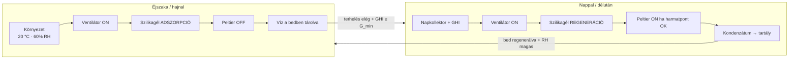
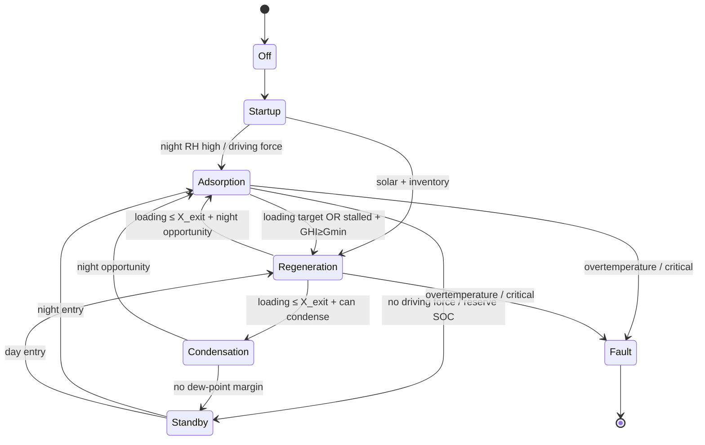

# ThermoCore
## 31_AwgSummerDiurnalOperation.md

**Version:** 1.0  
**Status:** Implemented  
**Document Type:** AWG summer diurnal operating modes, decision tables, sizing basis  
**Applies To:** ThermoCore.AWG  
**Related:** DOC-014 control, ambient matrix, `summer-diurnal` console command

---

# 1. Purpose

Define day/night operating modes for an average summer day:

| Period | Ambient | Goal |
|---|---|---|
| Night / dawn | ~20 °C, ~60% RH, GHI ≈ 0 | Capture moisture into silica (Adsorption) |
| Day / afternoon | ~32 °C, ~30% RH, GHI high | Desorb with solar heat + condense (Regeneration) |

Produce decision rules for **fan** and **Peltier** enablement, and the engineering basis for PV/battery sizing at 0.5 / 1 / 2 / 3 L/day.

---

# 2. Diurnal process overview



---

# 3. Operating modes

## 3.1 Night Adsorption (`Adsorption`)

- **When:** GHI &lt; 200 W/m² **and** adsorption driving force available (X_eq − X &gt; δ).
- **Fan:** ON (nominal).
- **Collector air coupling:** OFF (shade / bypass) — avoid heating the bed.
- **Peltier:** OFF — condenser after an adsorbing bed sees dry air.
- **Goal:** raise silica loading using cool, humid night air.

## 3.2 Day Regeneration (`Regeneration`)

- **When:** GHI ≥ 200 W/m² **and** bed loading above regeneration exit floor.
- **Fan:** ON.
- **Collector air coupling:** ON (ramp over ~3 min).
- **Peltier:** ON when electrical budget &gt; 0 (harvest as soon as dew point rises).
- **Goal:** dump bed water into the airstream and condense into the tank.

## 3.3 Condensation assist (`Condensation`)

- Used after regeneration exit while humid slug remains and dew-point margin is satisfied.
- **Fan:** ON, **Peltier:** ON, **collector coupling:** OFF.

## 3.4 Standby / protection

- Battery at reserve SOC, tank full, or safety limits → fan derated / loads off.
- Collector overtemperature and silica overtemperature latch Fault.

---

# 4. Supervisory state machine



---

# 5. Decision tables — fan and Peltier

## 5.1 Fan enable

| # | Condition | Fan | Notes |
|---|---|---|---|
| F1 | Mode ∈ {Off, Fault, ControlledShutdown} | **OFF** | Safe state |
| F2 | Mode = Standby **and** SOC ≤ reserve | **30%** | Keep sensing airflow minimal |
| F3 | Mode ∈ {Startup, Adsorption, Regeneration, Condensation} | **ON 100%** | Process airflow |
| F4 | Dry-air mass flow &lt; ṁ_min | **Fault** | Invalid operating point |

**Practical recommendation (summer diurnal):**

- Fan ON from ~sunset → mid-morning while adsorbing (typically 20:00–08:00 local).
- Fan ON while regenerating whenever GHI ≥ 200 W/m² (typically 08:00–17:00).
- Avoid continuous 24 h fan if SOC is low — prefer dwell in Standby.

## 5.2 Peltier enable

| # | Condition | Peltier | Power request |
|---|---|---|---|
| P1 | Tank full | **OFF** | — |
| P2 | Mode = Regeneration **and** P_avail &gt; 0 | **ON** | min(P_nom, P_avail) |
| P3 | Mode = Condensation **and** T_surface &lt; T_dp − Δ | **ON** | dew-point approach law |
| P4 | Mode = Adsorption | **OFF** | Bed strips vapor; no condensate |
| P5 | Mode = Standby / Off / Fault | **OFF** | — |
| P6 | SOC ≤ reserve | **derate ×0.25** | If still enabled by P2/P3 |

**Practical recommendation:**

| Local time (typical) | GHI | Ambient | Peltier |
|---|---|---|---|
| 00:00–07:00 | ~0 | cool / humid | **OFF** (adsorb) |
| 08:00–10:00 | rising | warming | **ON** once Regeneration entered |
| 10:00–16:00 | high | hot / dry | **ON** during regen pulses |
| 16:00–20:00 | falling | cooling | **ON** only if still regenerating / condensing |
| 20:00–24:00 | 0 | humid | **OFF** |

Default `P_nom = 120 W` (baseline). Higher daily liters require higher `P_nom` and/or longer regen duty — see sizing table.

---

# 6. Collector / heat path rules

| Mode | AirCouplingFraction | Why |
|---|---|---|
| Adsorption | → 0 | Keep bed cool; shade absorber |
| Regeneration | → 1 (ramped) | Deliver solar heat to bed |
| Condensation / Standby | → 0 | Stop desorption heat |

---

# 7. Sizing basis (0.5 / 1 / 2 / 3 L/nap)

1. Run controlled **24 h** summer-diurnal simulation (`summer-diurnal`).
2. Measure baseline liters and integrated electrical energy:
   - Bus loads (fan + controller)
   - Peltier proxy = condenser cooling request (W·h)
3. Specific energy: `Wh/L = E_day / L_baseline`
4. For target `L*`: scale `E* = (L*/L_baseline) · E_day`
5. PV rated power: `P_pv = E* / (PSH · η_mppt · 0.85)`
6. Battery: `E_batt = E*_night · 1.20 / (0.8 · 0.95)` using night energy (GHI &lt; 50 W/m²)

Artifacts: `samples/scenarios/awg-summer-diurnal/`.

---

# 8. Console

```bash
dotnet run --project src/ThermoCore.Console -- summer-diurnal
dotnet run --project src/ThermoCore.Console -- summer-diurnal --out samples/scenarios/awg-summer-diurnal
```

---

# 9. Limitations

- Peltier is not yet a real electrical bus load component; cooling request is used as electrical proxy.
- Linear scaling of Wh/L is a first-order estimate; re-simulate before hardware purchase.
- Heat-recovery tear is disabled in this pack (collector gating stability).
- PV cell temperature uses daily-mean ambient at build time (diurnal ambient swing not fully coupled into PV thermal mass).
