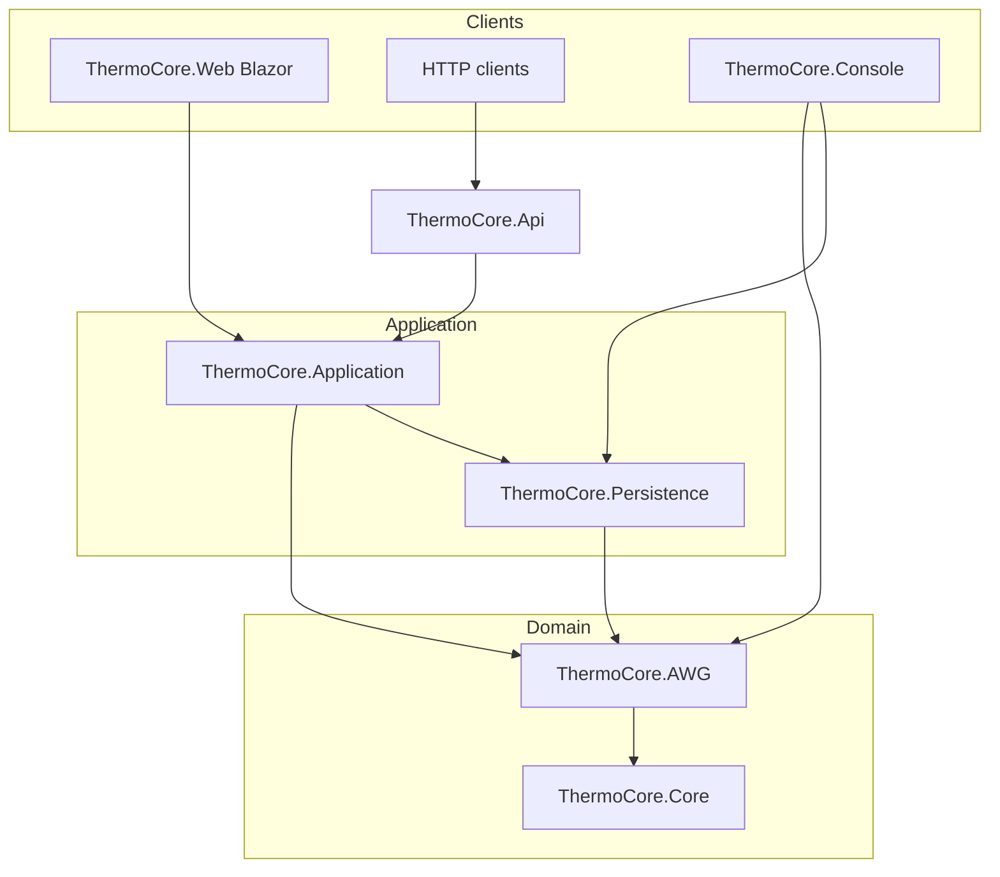

# ThermoCore architecture overview

Layering rules (enforced by architecture tests):

- Core must not reference AWG, Application, Api, Web, or Persistence
- AWG must not reference Application, Api, or Web
- Application may reference AWG, Core, and Persistence
