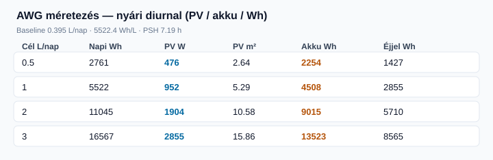
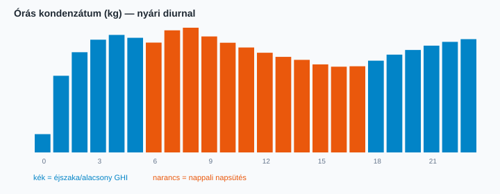

# Nyári diurnal AWG — szimuláció és méretezés

Átlagos nyári nap: **nappal ~32 °C / 30% RH**, **éjjel ~20 °C / 60% RH**, GHI csúcs 950 W/m² (06–18 h). Kontrollált Adsorption ↔ Regeneration, 24 h.

## Baseline (24 h)

| Metrika | Érték |
|---|---:|
| Termelt víz | 0.3954 L/nap |
| Napi villamos energia | 2183.7 Wh |
| Ebből busz (ventilátor+ctrl) | 1200 Wh |
| Ebből Peltier (proxy) | 983.7 Wh |
| PV termelés | 1940 Wh |
| Éjszakai energia (GHI&lt;50) | 1128.9 Wh |
| Fajlagos energia | 5522.4 Wh/L |
| Peak-sun-hours (profil) | 7.19 h |

## Méretezés célhoz (0.5 / 1 / 2 / 3 L/nap)



| Cél (L/nap) | Napi Wh | Wh/L | PV (W) | PV (m²) | Akkumulátor (Wh) | Éjszakai Wh |
|---:|---:|---:|---:|---:|---:|---:|
| 0.5 | 2761.2 | 5522.4 | 476 | 2.64 | 2254 | 1427.4 |
| 1 | 5522.4 | 5522.4 | 952 | 5.29 | 4508 | 2854.9 |
| 2 | 11044.8 | 5522.4 | 1904 | 10.58 | 9015 | 5709.7 |
| 3 | 16567.2 | 5522.4 | 2855 | 15.86 | 13523 | 8564.6 |

A méretezés a baseline fajlagos energia **lineáris skálázása**; beszerzés előtt célpontra újra kell szimulálni.

## Órás profil



| Óra | T (°C) | RH (%) | GHI | Víz (kg) | Mód | Peltier (W) | Fan on |
|---:|---:|---:|---:|---:|:---|---:|---:|
| 0 | 19.9 | 60 | 0 | 0.003 | Standby | 18 | 0.48 |
| 1 | 19.8 | 61 | 0 | 0.0126 | Condensation | 42 | 1.00 |
| 2 | 19.6 | 62 | 0 | 0.0165 | Condensation | 42 | 1.00 |
| 3 | 19.8 | 61 | 0 | 0.0186 | Condensation | 42 | 1.00 |
| 4 | 20.3 | 59 | 0 | 0.0194 | Condensation | 42 | 1.00 |
| 5 | 20.8 | 56 | 0 | 0.0189 | Condensation | 42 | 1.00 |
| 6 | 21.8 | 53 | 60 | 0.0181 | Condensation | 42 | 1.00 |
| 7 | 23.4 | 48 | 220 | 0.0201 | Condensation | 42 | 1.00 |
| 8 | 25.1 | 44 | 420 | 0.0206 | Condensation | 42 | 1.00 |
| 9 | 26.7 | 41 | 583 | 0.0191 | Condensation | 42 | 1.00 |
| 10 | 28.0 | 38 | 710 | 0.0181 | Condensation | 42 | 1.00 |
| 11 | 29.3 | 35 | 837 | 0.0173 | Condensation | 42 | 1.00 |
| 12 | 30.3 | 33 | 908 | 0.0164 | Condensation | 42 | 1.00 |
| 13 | 31.0 | 32 | 925 | 0.0158 | Condensation | 42 | 1.00 |
| 14 | 31.7 | 31 | 942 | 0.0153 | Condensation | 42 | 1.00 |
| 15 | 31.5 | 31 | 818 | 0.0145 | Condensation | 42 | 1.00 |
| 16 | 30.5 | 32 | 553 | 0.0141 | Condensation | 42 | 1.00 |
| 17 | 29.0 | 36 | 210 | 0.0142 | Condensation | 42 | 1.00 |
| 18 | 27.3 | 40 | 0 | 0.0151 | Condensation | 42 | 1.00 |
| 19 | 25.8 | 44 | 0 | 0.0161 | Condensation | 42 | 1.00 |
| 20 | 24.3 | 48 | 0 | 0.0169 | Condensation | 42 | 1.00 |
| 21 | 22.9 | 52 | 0 | 0.0176 | Condensation | 42 | 1.00 |
| 22 | 21.8 | 55 | 0 | 0.0182 | Condensation | 42 | 1.00 |
| 23 | 20.6 | 58 | 0 | 0.0187 | Condensation | 42 | 1.00 |

Üzemmódok / döntési táblák: [`docs/07_Applications/31_AwgSummerDiurnalOperation.md`](../../../docs/07_Applications/31_AwgSummerDiurnalOperation.md)

```bash
dotnet run --project src/ThermoCore.Console -- summer-diurnal
```
