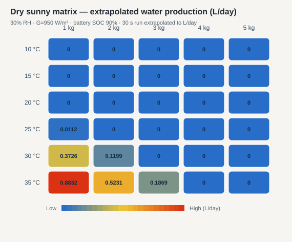
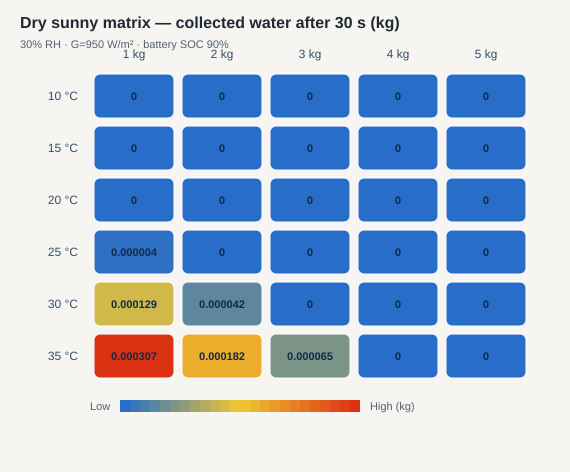
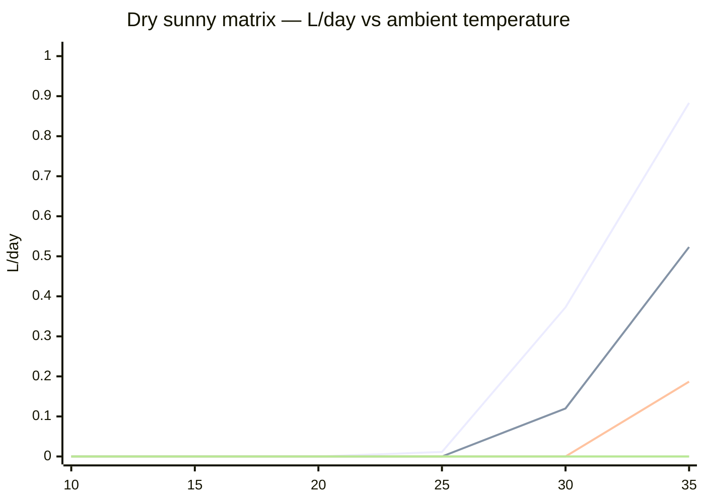

# Dry sunny matrix results

## Diagrams

### L/day heatmap

### Water after 30 s (kg)

### L/day vs temperature by silica mass

## Result table

| T (°C) | Silica (kg) | Water (kg) | L/day | Bus (W) | Final SOC | Pass |
|---:|---:|---:|---:|---:|---:|:---:|
| 10 | 1 | 0 | 0 | 0 | 0.9 | yes |
| 10 | 2 | 0 | 0 | 0 | 0.9 | yes |
| 10 | 3 | 0 | 0 | 0 | 0.9 | yes |
| 10 | 4 | 0 | 0 | 0 | 0.9 | yes |
| 10 | 5 | 0 | 0 | 0 | 0.9 | yes |
| 15 | 1 | 0 | 0 | 0 | 0.9 | yes |
| 15 | 2 | 0 | 0 | 0 | 0.9 | yes |
| 15 | 3 | 0 | 0 | 0 | 0.9 | yes |
| 15 | 4 | 0 | 0 | 0 | 0.9 | yes |
| 15 | 5 | 0 | 0 | 0 | 0.9 | yes |
| 20 | 1 | 0 | 0 | 0 | 0.9 | yes |
| 20 | 2 | 0 | 0 | 0 | 0.9 | yes |
| 20 | 3 | 0 | 0 | 0 | 0.9 | yes |
| 20 | 4 | 0 | 0 | 0 | 0.9 | yes |
| 20 | 5 | 0 | 0 | 0 | 0.9 | yes |
| 25 | 1 | 0.000004 | 0.0112 | 0 | 0.9 | yes |
| 25 | 2 | 0 | 0 | 0 | 0.9 | yes |
| 25 | 3 | 0 | 0 | 0 | 0.9 | yes |
| 25 | 4 | 0 | 0 | 0 | 0.9 | yes |
| 25 | 5 | 0 | 0 | 0 | 0.9 | yes |
| 30 | 1 | 0.000129 | 0.3726 | 0 | 0.9 | yes |
| 30 | 2 | 0.000042 | 0.1199 | 0 | 0.9 | yes |
| 30 | 3 | 0 | 0 | 0 | 0.9 | yes |
| 30 | 4 | 0 | 0 | 0 | 0.9 | yes |
| 30 | 5 | 0 | 0 | 0 | 0.9 | yes |
| 35 | 1 | 0.000307 | 0.8832 | 0 | 0.9 | yes |
| 35 | 2 | 0.000182 | 0.5231 | 0 | 0.9 | yes |
| 35 | 3 | 0.000065 | 0.1869 | 0 | 0.9 | yes |
| 35 | 4 | 0 | 0 | 0 | 0.9 | yes |
| 35 | 5 | 0 | 0 | 0 | 0.9 | yes |

Raw data: [`results.csv`](results.csv).
