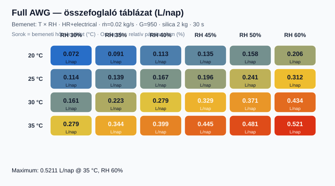
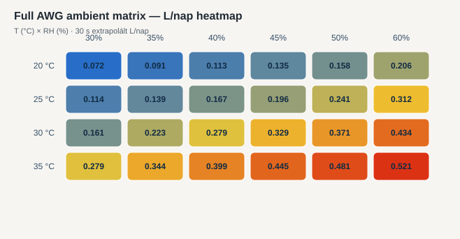

# Full AWG ambient matrix — összefoglaló

Bemenet: **T = 20–35 °C**, **RH = 30–60%**, controlled Full AWG V3 (Adsorption/Regeneration, electrical, no HR), ṁ = 0.02 kg/s, G = 950 W/m², silica = 2 kg regenerated start, SOC = 90%, 2 h.

## Összefoglaló táblázat (L/nap)





## L/nap mátrix

| T (°C) \ RH (%) | 30 | 35 | 40 | 45 | 50 | 60 |
|---:|---:|---:|---:|---:|---:|---:|
| **20** | 0.0721 | 0.0914 | 0.1126 | 0.1345 | 0.1578 | 0.2056 |
| **25** | 0.1136 | 0.1393 | 0.1672 | 0.1957 | 0.2408 | 0.3124 |
| **30** | 0.161 | 0.2234 | 0.2795 | 0.3285 | 0.3709 | 0.4344 |
| **35** | 0.2788 | 0.3441 | 0.3994 | 0.4446 | 0.4813 | 0.5211 |

## Részletes eredmények

| T (°C) | RH (%) | Water (kg) | L/nap | Bus (W) | SOC | Pass |
|---:|---:|---:|---:|---:|---:|:---:|
| 20 | 30 | 0.006005 | 0.0721 | 0 | 0.9 | yes |
| 20 | 35 | 0.00762 | 0.0914 | 0 | 0.9 | yes |
| 20 | 40 | 0.009383 | 0.1126 | 0 | 0.9 | yes |
| 20 | 45 | 0.011208 | 0.1345 | 0 | 0.9 | yes |
| 20 | 50 | 0.013149 | 0.1578 | 0 | 0.9 | yes |
| 20 | 60 | 0.017132 | 0.2056 | 0 | 0.9 | yes |
| 25 | 30 | 0.009467 | 0.1136 | 0 | 0.9 | yes |
| 25 | 35 | 0.01161 | 0.1393 | 0 | 0.9 | yes |
| 25 | 40 | 0.013937 | 0.1672 | 0 | 0.9 | yes |
| 25 | 45 | 0.016309 | 0.1957 | 0 | 0.9 | yes |
| 25 | 50 | 0.02007 | 0.2408 | 0 | 0.9 | yes |
| 25 | 60 | 0.026036 | 0.3124 | 0 | 0.9 | yes |
| 30 | 30 | 0.013414 | 0.161 | 0 | 0.9 | yes |
| 30 | 35 | 0.018619 | 0.2234 | 0 | 0.9 | yes |
| 30 | 40 | 0.02329 | 0.2795 | 0 | 0.9 | yes |
| 30 | 45 | 0.027376 | 0.3285 | 0 | 0.9 | yes |
| 30 | 50 | 0.030909 | 0.3709 | 0 | 0.9 | yes |
| 30 | 60 | 0.036202 | 0.4344 | 0 | 0.9 | yes |
| 35 | 30 | 0.02323 | 0.2788 | 0 | 0.9 | yes |
| 35 | 35 | 0.028679 | 0.3441 | 0 | 0.9 | yes |
| 35 | 40 | 0.033282 | 0.3994 | 0 | 0.9 | yes |
| 35 | 45 | 0.037054 | 0.4446 | 0 | 0.9 | yes |
| 35 | 50 | 0.040108 | 0.4813 | 0 | 0.9 | yes |
| 35 | 60 | 0.043427 | 0.5211 | 0 | 0.9 | yes |

**Legjobb L/nap:** 0.521125 @ 35 °C, RH 60%

Nyers adat: [`results.csv`](results.csv).

```bash
dotnet run --project src/ThermoCore.Console -- full-flow-ambient-matrix
```
