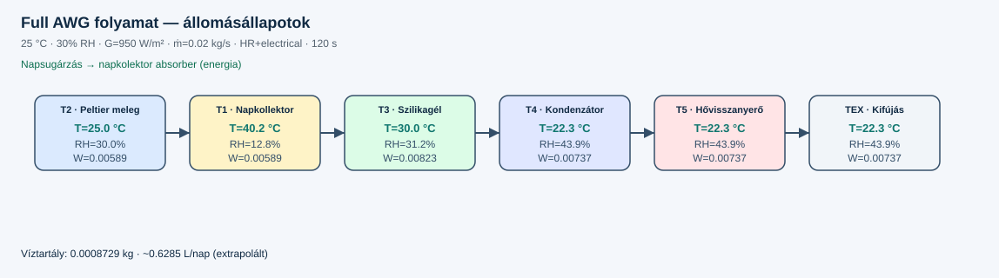
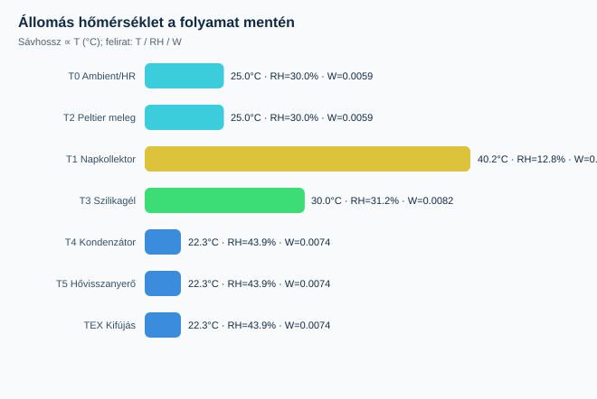

# Full AWG process flow — station results

ThermoCore AWG **V3** primary path (`15_SystemTopology.md`), with heat recovery and electrical subsystem.

> Note: process air order is **Peltier hot → napkollektor → szilikagél → kondenzátor → hővisszanyerő → kifújás**.
> Solar radiation feeds the collector absorber (energy path), not a reordering of the air train.

## Boundary

- Dry-air mass flow: **0.02 kg/s** (same as dry-sunny matrix)
- Ambient: **25 °C**, RH **30%**, G **950 W/m²**
- Silica dry mass: **2 kg**
- Heat recovery: **on**, electrical: **on**
- Run: **120 s**, Δt **1 s**
- Collected water: **0.000872869 kg** (~**0.6285 L/day** extrapolated)

## Process diagram





Matrix heatmaps: [`RESULTS.md`](RESULTS.md) · [`results-heatmap.svg`](results-heatmap.svg)

```text
              NAPSUGÁRZÁS
                   │
         ┌─────────▼─────────┐
         │    Napkollektor   │
         └─────────┬─────────┘
                   │  (energy into absorber)
Ambient → [HR cold] → Fan → Peltier meleg → Napkollektor → Szilikagél
                   → Kondenzációs kamra → Hővisszanyerő → Kifújás
```

## Station table (T, RH, W)

| Id | Állomás | T (°C) | RH | W (kg/kg) | ṁ_da (kg/s) | ṁ_v (kg/s) |
|---|---|---:|---:|---:|---:|---:|
| T0 | Környezeti belépés / HR hideg oldal | 25.00 | 30.0% | 0.005890 | 0.020 | 0.000118 |
| T2 | Peltier meleg oldal | 25.00 | 30.0% | 0.005890 | 0.020 | 0.000118 |
| T1 | Napkollektor | 40.19 | 12.8% | 0.005890 | 0.020 | 0.000118 |
| T3 | Szilikagél kazetta | 29.98 | 31.2% | 0.008232 | 0.020 | 0.000165 |
| T4 | Kondenzációs kamra (Peltier hideg oldal) | 22.35 | 43.9% | 0.007365 | 0.020 | 0.000147 |
| T5 | Hővisszanyerő (forró oldal) | 22.35 | 43.9% | 0.007365 | 0.020 | 0.000147 |
| TEX | Kifújás | 22.35 | 43.9% | 0.007365 | 0.020 | 0.000147 |

Raw: [`stations.csv`](stations.csv).

```bash
dotnet run --project src/ThermoCore.Console -- full-flow
dotnet run --project src/ThermoCore.Console -- regress --dir samples/scenarios/full-awg-flow
```
