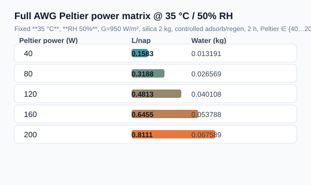
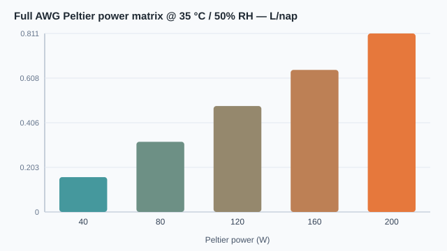

# Full AWG Peltier power matrix @ 35 °C / 50% RH

Fixed **35 °C**, **RH 50%**, G=950 W/m², silica 2 kg, controlled adsorb/regen, 2 h, Peltier ∈ {40…200} W.

## Összefoglaló táblázat (L/nap)





| Peltier power (W) | Water (kg) | L/nap | Pass |
|---:|---:|---:|:---:|
| 40 | 0.0131915 | 0.1583 | yes |
| 80 | 0.0265692 | 0.3188 | yes |
| 120 | 0.0401085 | 0.4813 | yes |
| 160 | 0.053788 | 0.6455 | yes |
| 200 | 0.0675892 | 0.8111 | yes |

**Legjobb L/nap:** 0.81107 @ 200 W

Nyers adat: [`results.csv`](results.csv).

```bash
dotnet run --project src/ThermoCore.Console -- full-flow-peltier-matrix
```
