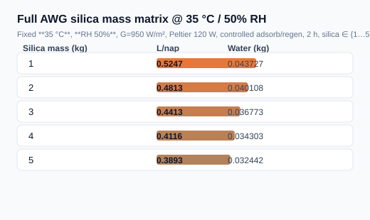
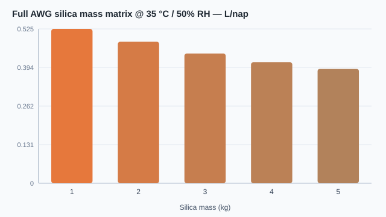

# Full AWG silica mass matrix @ 35 °C / 50% RH

Fixed **35 °C**, **RH 50%**, G=950 W/m², Peltier 120 W, controlled adsorb/regen, 2 h, silica ∈ {1…5} kg.

## Összefoglaló táblázat (L/nap)





| Silica mass (kg) | Water (kg) | L/nap | Pass |
|---:|---:|---:|:---:|
| 1 | 0.0437274 | 0.5247 | yes |
| 2 | 0.0401085 | 0.4813 | yes |
| 3 | 0.0367728 | 0.4413 | yes |
| 4 | 0.0343035 | 0.4116 | yes |
| 5 | 0.0324421 | 0.3893 | yes |

**Legjobb L/nap:** 0.524729 @ 1 kg

Nyers adat: [`results.csv`](results.csv).

```bash
dotnet run --project src/ThermoCore.Console -- full-flow-silica-matrix
```
